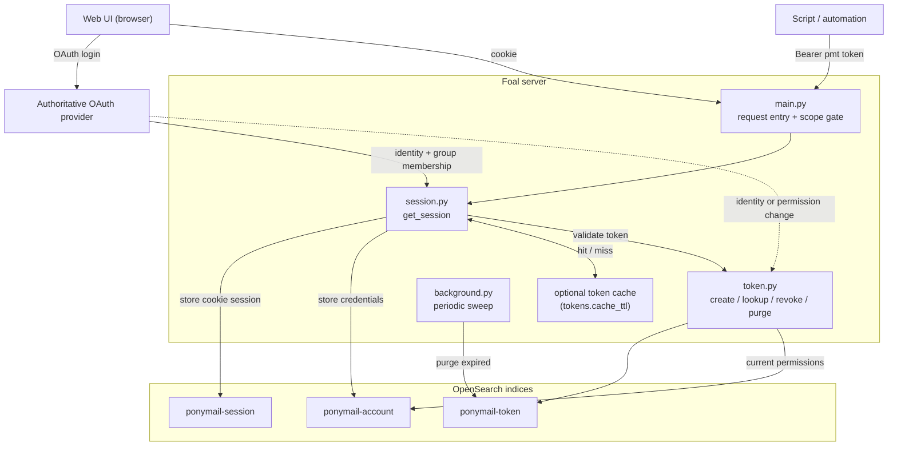
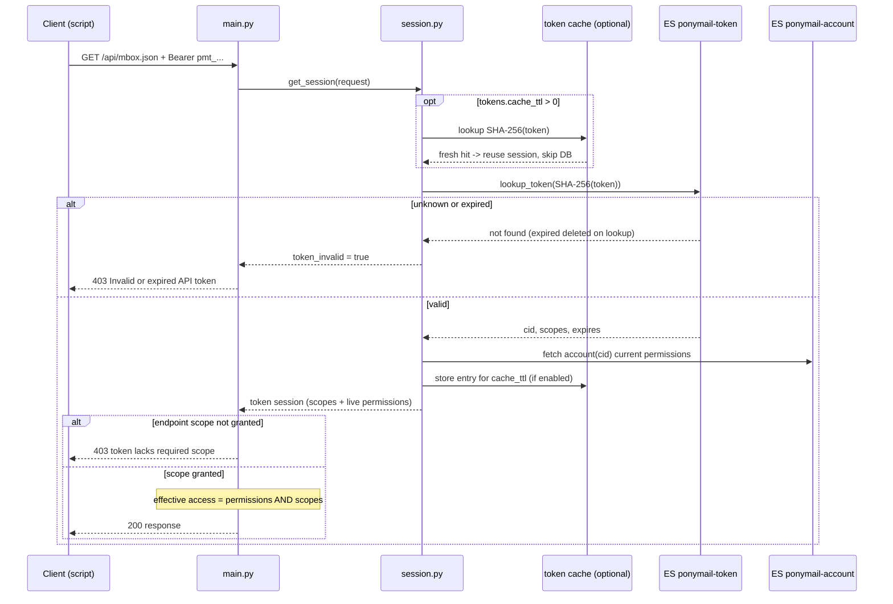
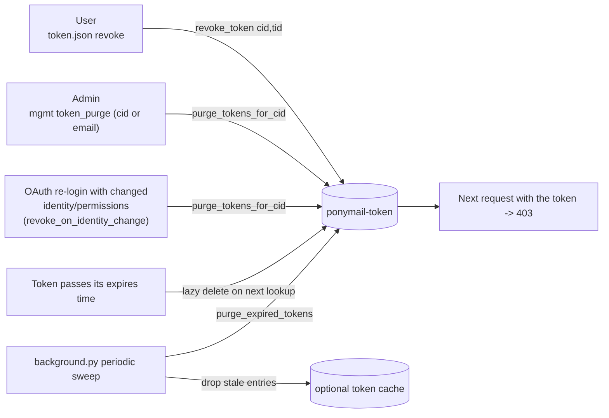

<!---
 Licensed to the Apache Software Foundation (ASF) under one or more
 contributor license agreements.  See the NOTICE file distributed with
 this work for additional information regarding copyright ownership.
 The ASF licenses this file to You under the Apache License, Version 2.0
 (the "License"); you may not use this file except in compliance with
 the License.  You may obtain a copy of the License at

      http://www.apache.org/licenses/LICENSE-2.0

 Unless required by applicable law or agreed to in writing, software
 distributed under the License is distributed on an "AS IS" BASIS,
 WITHOUT WARRANTIES OR CONDITIONS OF ANY KIND, either express or implied.
 See the License for the specific language governing permissions and
 limitations under the License.
-->

# Apache Pony Mail (Foal) — API Documentation

This document describes the HTTP API for Pony Mail Foal. All endpoints
accept JSON request bodies (POST) and return JSON unless otherwise noted.

The formal OpenAPI 3.0 specification is available at
[`server/openapi.yaml`](../server/openapi.yaml). You can auto-generate a typed
client library in most languages from it rather than hand-writing one — see
[Generating API Client Libraries](generating_api_clients.md).

---

## Table of Contents

- [Authentication](#authentication)
- [Endpoints](#endpoints)
  - [stats.json — Search/list emails](#statsjson)
  - [email.json — Fetch a single email](#emailjson)
  - [thread.json — Fetch an email thread](#threadjson)
  - [source.json — Fetch raw email source](#sourcejson)
  - [mbox.json — Download mbox archive](#mboxjson)
  - [compose.json — Send an email](#composejson)
  - [preferences.json — User preferences and list overview](#preferencesjson)
  - [token.json — Long-term API tokens](#tokenjson)
  - [mgmt.json — Administrative operations](#mgmtjson)
  - [pminfo.json — Server activity info](#pminfojson)
  - [gravatar.json — Avatar image proxy](#gravatarjson)
  - [plain.json — Plain HTML for search engines](#plainjson)
- [Common Parameters](#common-parameters)
  - [Date/Timespan Parameters](#datetimespan-parameters)
  - [Search Query Syntax](#search-query-syntax)
- [Differences from Legacy PonyMail API](#differences-from-legacy-ponymail-api)

---

## Authentication

Foal supports two ways of authenticating API requests:

1. **Cookie session (interactive).** Foal uses cookie-based sessions via OAuth.
   The session cookie is named `ponymail`. This is what the web UI uses.
2. **Long-term API token (programmatic).** Send an `Authorization: Bearer <token>`
   header. Tokens are ideal for scripts and automation: they are not subject to
   the short session-cookie lifetime and never require a browser round-trip. A
   token grants access up to that of the account that created it (including any
   private lists that account can reach), further limited by the token's
   [scopes](#scopes). Create and manage tokens via
   [`token.json`](#tokenjson) or the **API Tokens** entry in the web UI's user
   menu.

Most read endpoints work without authentication for public lists. Private list
access and write operations (compose, management) require an authenticated
session (cookie or token) via an authoritative OAuth provider.

If a request presents a bearer token that is invalid, revoked, or expired, the
server responds with **`403`** and `{"okay": false, "message": "Invalid or
expired API token."}` — it does **not** silently fall back to anonymous access,
so a client can detect the condition and refresh its credentials. (A token that
is merely missing a required [scope](#scopes) gets `403` with a different
message.)

Example using a token:

```
curl -H "Authorization: Bearer pmt_XXXXXXXX..." \
     "https://lists.example.org/api/mbox.json?list=dev@example.org&date=2024-01"
```

### How token authentication works

The diagrams below show every component involved: the authoritative **OAuth**
provider, `main.py` (request entry + scope gate), `session.py`, `token.py`, the
three OpenSearch indices, the **optional** in-memory token cache, and the
`background.py` housekeeping sweep.

#### Components



#### Creating a token

Tokens can only be minted from an interactive (cookie) session established via
OAuth — a token can never create another token. Only a SHA-256 digest of the
secret is stored, so the raw token is shown to the user exactly once.

```mermaid
sequenceDiagram
    actor User as User (browser)
    participant OA as OAuth provider
    participant API as main.py
    participant TP as token.py
    participant AS as ES ponymail-account
    participant TS as ES ponymail-token

    User->>OA: interactive OAuth login
    OA-->>API: identity + group membership
    API->>AS: upsert account credentials (cid)
    Note over API,User: user now holds a cookie session

    User->>API: POST /api/token.json (create, scopes, expires)
    Note over API: rejected unless caller has a cookie session
    API->>TP: create_token(cid, scopes, expires)
    TP->>TP: raw = "pmt_" + 256-bit random secret
    TP->>TS: store id=SHA-256(raw), cid, scopes, expires
    TP-->>User: raw token (shown once; only its hash is kept)
```

#### Authenticating a request

A bearer token is validated on every request (no cookie-lifetime limit). With
the optional cache enabled (`tokens.cache_ttl > 0`) a recently-seen token skips
the two database reads, at the cost of delaying revocation/expiry by up to
`cache_ttl` seconds. The effective access is the intersection of the token's
scopes and the owner's **current** account permissions, so a token can only ever
restrict access, never escalate it.



#### Revocation and expiry

Five mechanisms make sure a token cannot outlive the access it was minted for.
All of them delete the row from `ponymail-token`, after which the next request
carrying that token gets a `403`.



See [`plugins/token.py`](../server/plugins/token.py) and
[`plugins/session.py`](../server/plugins/session.py) for the implementation.

---

## Endpoints

### stats.json

**Search the archives and return matching results.**

```
POST /api/stats.json
```

#### Request Parameters

| Parameter | Type | Required | Description |
|-----------|------|----------|-------------|
| `list` | string | **yes** | List name prefix (e.g. `dev`). Use `*` for wildcard. |
| `domain` | string | **yes** | List domain (e.g. `httpd.apache.org`). Use `*` for wildcard. |
| `d` | string | no | Date/timespan (see [below](#datetimespan-parameters)) |
| `s` | string | no | Start month (`yyyy-mm`) |
| `e` | string | no | End month (`yyyy-mm`) |
| `dfrom` | string | no | Start date as days ago |
| `dto` | string | no | Number of days to include from `dfrom` |
| `q` | string | no | Free-text search query (see [syntax](#search-query-syntax)) |
| `header_from` | string | no | Filter by `From:` header |
| `header_to` | string | no | Filter by `To:` header |
| `header_subject` | string | no | Filter by `Subject:` header |
| `header_body` | string | no | Filter by message body |
| `header_messageid` | string | no | Filter by `Message-ID:` header |
| `quick` | (presence) | no | Return statistics only (omit emails, thread_struct, word cloud, participants) |
| `emailsOnly` | (presence) | no | Return email summaries only (omit thread_struct, participants, word cloud) |
| `since` | integer | no | UNIX epoch; returns `{"changed": false}` if no emails are newer |

#### Response (StatsResponse)

```json
{
  "hits": 134,
  "numparts": 28,
  "no_threads": 35,
  "firstYear": 2018,
  "firstMonth": 1,
  "lastYear": 2021,
  "lastMonth": 11,
  "name": "dev",
  "domain": "lists.example.org",
  "list": "dev@lists.example.org",
  "searchlist": "<dev.lists.example.org>",
  "active_months": [{"2021-01": 15}, {"2021-02": 23}],
  "emails": [ /* array of CompactEmailResponse */ ],
  "thread_struct": [ /* threaded representation */ ],
  "participants": [
    {"email": "jane@example.org", "name": "Jane Doe", "count": 10, "gravatar": "..."}
  ],
  "cloud": {"word1": 25, "word2": 10},
  "searchParams": {"list": "dev", "domain": "lists.example.org", "d": "gte=2018-01"},
  "unixtime": 1506761839
}
```

#### Example

```bash
curl -X POST https://lists.apache.org/api/stats.json \
  -H "Content-Type: application/json" \
  -d '{"list": "dev", "domain": "ponymail.apache.org", "d": "lte=3M"}'
```

---

### email.json

**Fetch a single email by permalink ID or Message-ID.**

```
POST /api/email.json
```

#### Request Parameters

| Parameter | Type | Required | Description |
|-----------|------|----------|-------------|
| `id` | string | **yes** | Email permalink ID or Message-ID header value |
| `listid` | string | conditional | Required when looking up by Message-ID (for disambiguation) |
| `attachment` | boolean | no | Set to `true` to fetch an attachment |
| `file` | string | no | Attachment hash (required when `attachment=true`) |

#### Response (SingleEmailResponse)

```json
{
  "id": "r8cmj7vm5n8z5r3xda5ebd",
  "mid": "r8cmj7vm5n8z5r3xda5ebd",
  "dbid": "08c4e61930db221d...",
  "message-id": "<521062724.28.1506761839312.JavaMail.jenkins@host>",
  "from": "Jane Doe <jane@example.org>",
  "from_raw": "Jane Doe <jane@example.org>",
  "to": "dev@example.org",
  "cc": "announce@example.org",
  "subject": "Re: weekly meeting",
  "date": "2017/09/30 08:57:19",
  "epoch": 1506761839,
  "list": "<dev.example.org>",
  "list_raw": "<dev.example.org>",
  "body": "Full message body...",
  "body_short": "Truncated to 201 chars...",
  "private": false,
  "references": "<parent-message-id>",
  "in-reply-to": "<parent-message-id>",
  "attachments": [],
  "permalinks": ["r8cmj7vm5n8z5r3xda5ebd", "..."],
  "gravatar": "69eea47c5083c2e4945a2704fc7b658c"
}
```

**Notes:**
- `date` and `epoch` are in UTC.
- When `attachment=true` and a matching `file` hash is found, the raw
  attachment binary is returned with appropriate Content-Type and
  Content-Disposition headers.

---

### thread.json

**Fetch a complete email thread starting from a given email.**

```
POST /api/thread.json
```

#### Request Parameters

| Parameter | Type | Required | Description |
|-----------|------|----------|-------------|
| `id` | string | **yes** | Email permalink ID or Message-ID |
| `listid` | string | no | List-ID for disambiguation when using Message-ID |
| `find_parent` | boolean | no | If `true`, navigate up to the thread root before fetching |

#### Response (ThreadResponse)

```json
{
  "thread": {
    "from": "...",
    "subject": "...",
    "id": "...",
    "epoch": 1506761839,
    "children": [ /* nested CompactEmailResponse objects */ ]
  },
  "emails": [ /* flat array of all emails in the thread */ ]
}
```

---

### source.json

**Fetch the raw mbox source of an email.**

```
POST /api/source.json
```

#### Request Parameters

Same as [email.json](#emailjson) (`id`, optional `listid`).

#### Response

Returns the raw RFC 2822 email source as `text/plain`. This includes all
original headers and the unmodified message body.

Returns HTTP 404 if the email is not found.

---

### mbox.json

**Download a set of emails in mbox format.**

```
POST /api/mbox.json
```

#### Request Parameters

Same as [stats.json](#statsjson) — all search/date parameters apply.

#### Response

Returns the matching emails as a single mbox-format file (`text/plain`).

---

### compose.json

**Compose and send an email to a list.** Requires authentication via
an authoritative OAuth provider.

```
POST /api/compose.json
```

#### Request Parameters

| Parameter | Type | Required | Description |
|-----------|------|----------|-------------|
| `to` | string | **yes** | Recipient address (must match `sender_domains` config) |
| `subject` | string | **yes** | Email subject |
| `body` | string | **yes** | Email message body |
| `references` | string | no | Message-ID reference (if not a direct reply) |
| `in-reply-to` | string | no | Message-ID of the email being directly replied to |

#### Response (ActionResponse)

```json
{"okay": true, "message": "Email dispatched"}
```

**Note:** The `sender_domains` configuration controls which recipient
domains are permitted. See [INSTALL.md](../INSTALL.md#setting-up-web-replies).

---

### preferences.json

**Fetch user preferences, list overview, and OAuth provider configuration.**

```
POST /api/preferences.json
```

#### Request Parameters

| Parameter | Type | Required | Description |
|-----------|------|----------|-------------|
| `oauth` | boolean | no | If `true`, return only OAuth provider configuration |

#### Response

```json
{
  "login": {
    "credentials": {"fullname": "Jane Doe", "email": "jane@example.org"}
  },
  "lists": {
    "httpd.apache.org": {"dev": 1523, "users": 890},
    "ponymail.apache.org": {"dev": 36}
  },
  "versions": {
    "foal": "abc123",
    "server": "def456",
    "elasticsearch_engine": "8.11.0",
    "elasticsearch_library": "8.11.0"
  }
}
```

**Notes:**
- `versions.server`, `elasticsearch_engine`, and `elasticsearch_library`
  are only returned for authenticated users (admin-only for OpenSearch versions).
- When `oauth=true`, returns the configured OAuth providers for the login UI.

---

### token.json

**Create, list, and revoke long-term API tokens for the logged-in user.**

```
POST /api/token.json
```

Requires an interactive (cookie) session — tokens cannot be managed using token
authentication. The raw token secret is returned **only once**, at creation
time; the server stores only a hash of it.

`list` is the default action. `create` and `revoke` must be sent as actions in a
JSON POST body; mutation actions in query parameters are rejected.

#### Request Parameters

| Parameter | Type | Required | Description |
|-----------|------|----------|-------------|
| `action` | string | no | One of `list` (default), `create`, `revoke` |
| `description` | string | no | (`create`) Human-readable label for the token |
| `scopes` | string/list | no | (`create`) Scopes to grant (space/comma-separated or a JSON list). Defaults to `read`. |
| `lifetime` | integer | no | (`create`) Lifetime in seconds; `0` = never expires. Defaults to the server's configured default (30 days). Clamped to the server maximum if one is set. |
| `id` | string | no | (`revoke`) Id of the token to revoke |

#### Scopes

A token's effective access is the **intersection** of its owner's account
permissions and its scopes — a scope can only *restrict* access, never grant
more than the account already has. A request with a token that lacks the
required scope for an endpoint gets `403`.

| Scope | Grants | Endpoints |
|-------|--------|-----------|
| `read` | Read the archives (search, fetch emails/threads/sources, download mbox, preferences) | `stats`, `email`, `thread`, `source`, `mbox`, `preferences`, `pminfo`, `gravatar`, `plain` |
| `write` | Send email | `compose` |
| `admin` | Administrative operations (hide/delete/edit) — only effective for admin accounts | `mgmt` |

A scope is a **wish, not a stored grant.** The server does *not* snapshot the
owner's permissions into the token when it is created. On **every** request it
recomputes the effective access as the intersection of the token's scopes with
the owner's **current** account permissions, resolved live from the account
record at that moment. Two consequences follow:

- If the owner **loses** a permission (removed from a private list, or their
  admin/moderator status is dropped), every existing token immediately loses
  that access on its next request — regardless of the scope it was minted with.
  A token is therefore *not* a cached copy of permissions that could go stale;
  there is nothing to invalidate or evict when permissions shrink.
- If the owner **gains** a permission after a token was created, a token whose
  scope already covers it starts working for the newly reachable resource
  automatically, with no need to re-issue the token.

The `admin` scope illustrates this: it only ever grants administrative access
while the underlying account is *currently* an admin (see the
[`oauth.admins`](configuration.md#oauth) list) — minting an `admin`-scoped
token does not make a non-admin an admin, and an admin who is later removed
from `oauth.admins` loses admin access through all of their tokens at once.

Revoking a token (`action=revoke`) remains the way to kill one *specific*
credential (for example a leaked one); reducing what the *account* itself can
do is handled entirely by the live intersection above. To forcibly cut off
**all** of a user's tokens at once — e.g. after their upstream credentials are
reset — an administrator can use [`mgmt.json`](#mgmtjson)'s `token_purge`
action.

#### Response

`action=create` (the only time the raw `token` is shown):

```json
{
  "okay": true,
  "id": "3f9a...c1",
  "description": "laptop backup script",
  "created": 1717977600,
  "expires": 1720569600,
  "last_used": 0,
  "scopes": ["read"],
  "token": "pmt_XXXXXXXXXXXXXXXXXXXXXXXXXXXXXXXXXXXXXXXXXXX"
}
```

`action=list`:

```json
{
  "okay": true,
  "tokens": [
    {"id": "3f9a...c1", "description": "laptop backup script", "scopes": ["read"],
     "created": 1717977600, "expires": 1720569600, "last_used": 1718000000}
  ]
}
```

**Notes:**
- Use a token by sending `Authorization: Bearer <token>` on any API request
  (see [Authentication](#authentication)).
- Token management is disabled when `tokens.enabled` is `false` in
  `ponymail.yaml`.

---

### mgmt.json

**Administrative endpoint for email management (GDPR operations).**
Requires admin authentication.

```
POST /api/mgmt.json
```

#### Request Parameters

| Parameter | Type | Required | Description |
|-----------|------|----------|-------------|
| `action` | string | **yes** | One of: `log`, `delete`, `hide`, `unhide`, `edit`, `token_purge` |
| `document` | string | no | Single document permalink ID |
| `documents` | array | no | Array of document permalink IDs (batch operations) |
| `size` | integer | no | Number of audit log entries (for `action=log`, default: 50) |
| `page` | integer | no | Page offset for audit log |
| `filter` | string | no | Filter audit log by action type |
| `cid` | string | no | (`token_purge`) Account id whose tokens to purge |
| `email` | string | no | (`token_purge`) Email whose tokens to purge (resolves to every account with that address) |

**Actions:**

- `log` — View the audit log of past admin actions
- `delete` — Permanently delete emails (if `allow_delete` is configured) or hide them
- `hide` — Hide emails from public view (recoverable)
- `unhide` — Restore previously hidden emails
- `edit` — Edit email metadata (list-id, etc.)
- `token_purge` — Revoke **all** API tokens belonging to a user. Identify the
  user by `cid` or `email` (at least one is required). Intended for when a
  user's upstream credentials are reset or compromised and every long-term
  token they hold must be cut off at once. Each purge is recorded in the audit
  log as a `token_purge` entry. (Note: a normal login that changes a user's
  OAuth identity already purges their tokens automatically — see
  [`tokens.revoke_on_identity_change`](configuration.md#tokens).)

#### Response

Varies by action. For `log`:

```json
{"entries": [ /* audit log entries */ ]}
```

For `token_purge`:

```json
{"okay": true, "accounts": ["3f9a…c1"], "deleted": 4, "message": "Purged 4 token(s)."}
```

For mutations: returns an `ActionResponse` with `okay` and `message`.

---

### pminfo.json

**Return server activity statistics.** No authentication required.

```
POST /api/pminfo.json
```

Returns the server's gathered activity data (list counts, processing stats).

---

### gravatar.json

**Caching proxy for Gravatar images.**

```
POST /api/gravatar.json
```

#### Request Parameters

| Parameter | Type | Required | Description |
|-----------|------|----------|-------------|
| `md5` | string | **yes** | MD5 hash of the email address (lowercased) |

Returns a `image/png` response with 24-hour cache headers. Falls back to
a default avatar if the hash is unknown.

---

### plain.json

**Plain HTML rendering for search engine indexing.**

This endpoint serves publicly available lists and threads as simple HTML
with canonical link elements, enabling search engines to index the archive
content and link to the standard JS-based UI URLs.

---

## Common Parameters

### Date/Timespan Parameters

The `d` parameter supports several formats:

| Format | Meaning | Example |
|--------|---------|---------|
| `yyyy-mm` | Specific month | `2021-06` |
| `lte=N[wMyd]` | Less than N weeks/Months/years/days ago | `lte=3M` |
| `gte=N[wMyd]` | More than N weeks/Months/years/days ago | `gte=1y` |
| `dfr=yyyy-mm-dd\|dto=yyyy-mm-dd` | Date range (inclusive) | `dfr=2021-09-01\|dto=2021-09-30` |

The `s` and `e` parameters provide an alternative way to specify a
month range: `s=2021-01&e=2021-06`.

The `dfrom`/`dto` pair specifies days: `dfrom=31` (31 days ago) with
`dto=10` (10 days of data starting from that point).

**Units:** `w` = weeks, `M` = Months, `y` = years, `d` = days.

`lte` and `gte` are mutually exclusive. `dfr` and `dto` are normally
used together.

### Search Query Syntax

The `q` parameter supports:

| Syntax | Meaning | Example |
|--------|---------|---------|
| `word` | Must contain word | `apples` |
| `+word` | Word must be present | `+oranges` |
| `-word` | Word must NOT be present | `-bananas` |
| `"phrase"` | Exact phrase match | `"weekly meeting"` |

Additional filters can narrow results:

- `header_from` — match sender address
- `header_to` — match recipient address
- `header_subject` — match subject line
- `header_body` — match message body only
- `header_messageid` — match Message-ID header

---

## Differences from Legacy PonyMail API

Foal's API is largely compatible with the original Lua-based PonyMail,
with the following notable differences:

| Change | Details |
|--------|---------|
| Endpoint suffix | Foal uses `.json` (e.g. `/api/stats.json`) instead of `.lua` |
| Method | All endpoints use POST with JSON body (legacy used GET with query params) |
| `notifications.lua` | **Not available** in Foal |
| `atom.lua` | **Not available** in Foal |
| Additional email fields | `dbid`, `permalinks`, `body_short`, `from_raw`, `list_raw` are new in Foal |
| `find_parent` | New parameter on `thread.json` to navigate to thread root |
| `versions` in preferences | New — shows Foal, server, and OpenSearch version info |
| `mgmt.json` | New — admin/GDPR management endpoint (not in legacy PM) |
| `gravatar.json` | New — caching proxy (legacy embedded gravatar handling differently) |
| `plain.json` | New — search engine indexing support |

---

## Related Resources

- [OpenAPI Specification](../server/openapi.yaml) — formal schema definition
- [Installation Guide](../INSTALL.md) — setup and configuration
- [Server README](../server/README.md) — running the backend
